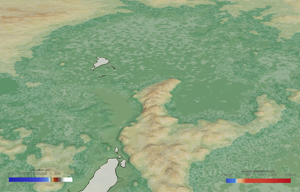

Examples
==============

There are numerous resources that you might find useful for learning and using **eSCAPE**.

The following set of notebooks go through the main workflows for constructing and running **eSCAPE**  models. These models demonstrate current best usage practises, and are guaranteed to operate correctly for each **eSCAPE** release.

They are available as a github repository.

.. code:: bash

  git clone https://github.com/Geodels/eSCAPE-demo.git

.. important::
  The proposed examples require to create input files and the **easiest and recommended way** for creating them is to use the Jupyter Notebooks available in the (**Geodels escape-docker**) container.

+---------------------------------+
| Required Python Skills          |
+---------------------------------+

To use **eSCAPE** successfully, you will need to have an understanding of the following Python constructs:

1. Basic Python, such as importing modules, and syntax structure (indenting, functions, etc).
2. Containers such as dictionaries, lists and tuples.
3. Flow control (loops, if-else conditionals, etc).
4. Python objects, object methods, object attributes, object lifecycles.

Most beginner (or intermediate) Python tutorials should cover these concepts.

**eSCAPE**  uses `h5py` for all heavy data disk IO. `H5py` is a Python library which provides a Python interface to writing/reading HDF5 format files. While not strictly required, more advanced users will certainly find having some familiarity with the `h5py` libary useful, both for directly querying files **eSCAPE** has generated, and also for writing their own files (in preference to CSV for example).

+---------------------------------+
| Jupyter Notebooks               |
+---------------------------------+

Jupyter Notebooks is the recommended environment for most model development. In **badlands** we utilise notebooks to provide inline visualisation of your model configurations, allowing you to quickly see your results, modify as required, and then regenerate and repeat.

If you are new to Jupyter Notebooks, you should familiarise yourself with the notebook environment first. Also, remember the **Help** menu bar option provides useful references and keyboard shortcuts.

+---------------------------------+
| How to get help                 |
+---------------------------------+

If you encounter issues or suspect a bug, please create a ticket using the `issue tracker on github`_.

.. _`issue tracker on github`: https://github.com/Geodels/eSCAPE/issues

Testing models
--------------

A series of examples are available with the source code. These examples illustrate the different capabilities of the code and are an ideal starting point to learn how to use **eSCAPE**. Each folder is composed of

1. an input YML file where the different options for the considered experiment are set,
2. a data folder containing the initial surface and potentially some forcing files (e.g. sea-level, rainfall or tectonic grids) and
3. a series of IPython notebooks used to run the experiment and perform some pre or post-processing tasks.

.. tip::
  The range of simulations varies both in term of spatial and temporal resolutions. You can browse the list of examples directly from the IPython notebooks.

Examples on the Docker container
^^^^^^^^^^^^^^^^^^^^^^^^^^^^^^^^^

Six examples are available from the **notebooks** folder in the docker container. These examples illustrate how to setup input files and run the code either in serial or in parallel.

.. note::
  Even if you are planning to run **eSCAPE** on HPC you should install the container on your local machine to generate the inputs required by the code to run.

Running eSCAPE
^^^^^^^^^^^^^^^^^^^^^^^^^^^^^^^^^^^^

Either via *jupyter notebooks* or *Python* files.

.. code:: bash

  python3 run_eSCAPE.py -i input.yml -v

where the :code:`run_eSCAPE.py` script takes one required argument the input filename and an optional verbose command (:code:`-v`).  To run the script in parallel simply use the :code:`mpirun` command. As an example with N processors it will look like:

.. code:: bash

  mpirun -np N python run_eSCAPE.py -i input.yml

:code:`run_eSCAPE.py` consists of a limited number of calls to **eSCAPE**

.. code:: python

  import eSCAPE
  model = eSCAPE.LandscapeEvolutionModel(***)
  model.runProcesses()
  model.destroy()

as shown below:

.. code:: python

  import argparse
  import eSCAPE as sim

  # Parsing command line arguments
  parser = argparse.ArgumentParser(description='This is a simple entry to run eSCAPE model.',add_help=True)
  parser.add_argument('-i','--input', help='Input file name (YAML file)',required=True)
  parser.add_argument('-v','--verbose',help='True/false option for verbose', required=False,action="store_true",default=False)
  parser.add_argument('-l','--log',help='True/false option for PETSC log', required=False,action="store_true",default=False)

  args = parser.parse_args()
  if args.verbose:
    print("Input file: {}".format(args.input))
    print(" Verbose is on? {}".format(args.verbose))
    print(" PETSC log is on? {}".format(args.log))

  # Reading input file
  model = sim.LandscapeEvolutionModel(args.input,args.verbose,args.log)

  # Running model
  model.runProcesses()

  # Cleaning model
  model.destroy()

Example running scripts used on specific HPC platforms
^^^^^^^^^^^^^^^^^^^^^^^^^^^^^^^^^^^^^^^^^^^^^^^^^^^^^^^^^^^^^^^^^^^^

Here is an example of PBS job for `Artemis` HPC Platform (USyD):

.. code:: bash

  #!/bin/bash

  # Project
  #PBS -P BGH

  # 64 CPUs
  #PBS -l select=8:ncpus=8:mpiprocs=8:mem=8GB

  # Time limit
  #PBS -l walltime=10:00:00
  #PBS -q alloc-dm

  # Set up environment
  module load python/2.7.15-intel petsc-intel-mpi hdf5

  cd $PBS_O_WORKDIR
  cd earth

  # Launching the job!
  mpirun -np 64 python run_escape.py

with :code:`run_escape.py` a python script calling **eSCAPE** function:

.. code:: python

  import eSCAPE as sim

  # Reading input file
  model = sim.LandscapeEvolutionModel('input_globe.yml',False,False)

  # Running model
  model.runProcesses()

  # Cleaning model
  model.destroy()

Use :code:`qsub` command to launch.

Workshop
---------

A set of workshop documents and models are also provided and aims to introduce those interested in landscape evolution and source to sink problems to **eSCAPE**.

The set of problems is quite broad and should be of interest to a wide community. The workshop has been designed to run over a couple of days but can be shorten if needed!

.. note::
  You do not have to be a seasoned modeller to participate. Geomorphologists, tectonicists and sedimentologists interested in testing conceptual models based on field observations are welcome!

**We welcome all kinds of contributions!** Please get in touch if you would like to help out.

.. important::
  Everything from **code** to **notebooks** to **examples** and **documentation** are all equally valuable so please don't feel you can't contribute.

  To contribute please **fork the project make your changes and submit a pull request**. We will do our best to work through any issues with you and get your code merged into the main branch.

If you found a bug, have questions, or are just having trouble with **eSCAPE**, you can:

* join the **eSCAPE User Group on Slack** by sending an email request to: tristan.salles@sydney.edu.au
* open an issue in our issue-tracker_ and we'll try to help resolve the concern.

.. _issue-tracker: https://github.com/Geodels/eSCAPE/issues
