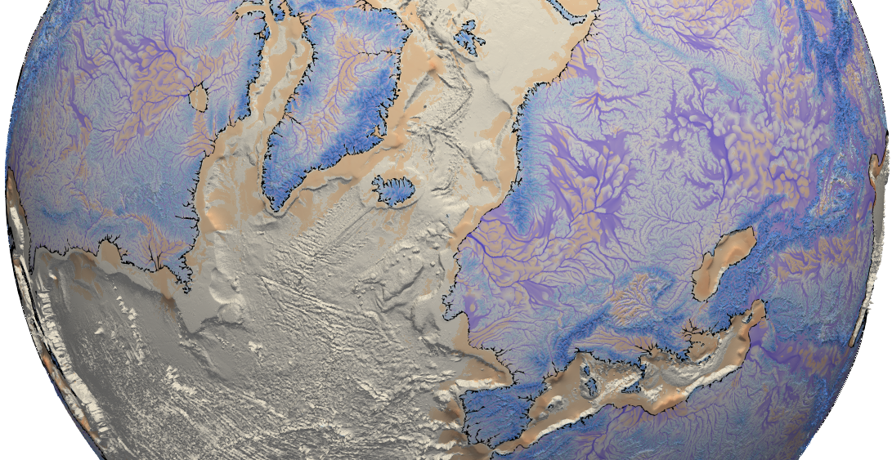

Getting started with eSCAPE
====================================

.. image:: https://readthedocs.org/projects/escape/badge/?version=latest
  :target: https://escape.readthedocs.io/en/latest/?badge=latest
  :alt: Documentation Status

.. image:: https://img.shields.io/docker/pulls/geodels/escape-docker
  :target: https://cloud.docker.com/u/geodels/repository/docker/geodels/escape-docker/general
  :alt: Docker Pulls

.. image:: https://joss.theoj.org/papers/10.21105/joss.00964/status.svg
   :target: https://doi.org/10.21105/joss.00964

.. image:: https://zenodo.org/badge/DOI/10.5281/zenodo.3239569.svg
   :target: https://doi.org/10.5281/zenodo.3239569

`Earth Landscape` (eSCAPE) is a long-term surface evolution model, built to simulate
topography dynamic, sediment transport and sedimentary basins formation at various space and
time scales.

----------

What's eSCAPE?
------------------

eSCAPE is an open-source Python-based code and can be used to simulate:

* hillslope processes (soil creep using *linear* diffusion),
* fluvial incision (*stream power law*),
* sediment transport and deposition,
* spatially and temporally varying tectonics (vertical displacements) and
* climatic forces (rainfall) and/or sea-level fluctuations.

.. image:: https://img.shields.io/github/license/badlands-model/badlands
 :target: https://github.com/Geodels/eSCAPE
 :alt: GitHub

.. image:: https://img.shields.io/github/stars/Geodels/eSCAPE
 :target: https://github.com/Geodels/eSCAPE
 :alt: GitHub stars

.. image:: https://img.shields.io/twitter/follow/salles_tristan?label=eSCAPE&style=plastic
 :target: https://twitter.com/salles_tristan
 :alt: Twitter Follow

----------

.. toctree::
   :maxdepth: 3
   :name: Hand's on!
   :caption: Hand's on!

   install.rst
   yml.rst
   examples.rst

.. toctree::
   :maxdepth: 3
   :name: How to cite?
   :caption: How to cite?

   cite.rst

.. toctree::
   :maxdepth: 3
   :name: Help & Projects
   :caption: Help & Projects

   social.rst

.. toctree::
    :maxdepth: 3
    :name: Code Source
    :caption: Code Source

    api.rst
