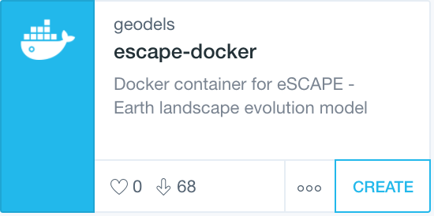

Installation
==============

We provide two ways to use **eSCAPE** from:

* the `docker image`_ or
* from a local install via `setuptools`_.

.. _`docker image`: https://cloud.docker.com/u/geodels/repository/docker/geodels/escape-docker/general
.. _`setuptools`: https://github.com/Geodels/eSCAPE/blob/master/setup.py

----------

Docker
------

If you like the **live demo**, you can install **eSCAPE** via Docker_!

Docker_ is a type of lightweight virtualisation, and is the preferred method for **eSCAPE** usage on personal computers. You will first need to install Docker on your system, and then you may install **eSCAPE** via Docker_.

.. note::
  Docker may be driven from the command line, but new users may wish to use the Docker Kitematic GUI instead for ease.

Simply search for `escape-docker`_ within Kitematic, and then click **'CREATE'** to launch a container. You will eventually wish to modify your container settings (again through Kitematic) to enable local folder volume mapping, which will allow you to access your local drives within your container.

.. _Docker: https://www.docker.com/products/docker-desktop

.. _`escape-docker`: https://cloud.docker.com/u/geodels/repository/docker/geodels/escape-docker/general

For Linux users, and those who prefer the command line, the following minimal command should be sufficient to access the badlands Jupyter Notebook examples:

.. code:: bash

   docker pull geodels/escape-docker

Once downloaded you will now be able to run **eSCAPE** locally.

.. important::
  You only need to pull the image once. Once it is installed you will only have to run the following command to start the code.

.. code:: bash

   docker run -it -p 8888:8888 -v "$PWD":/live/share geodels/escape-docker

Navigate to `localhost:8888 <localhost:8888>`_ to see the notebooks.

This command will create a new container using the `escape-docker`_ image. Note that it will first check to see if the image exists locally, and otherwise will download a copy from the Docker Hub.
This will only happen the first time you run the command; subsequent execution will use the downloaded image.

Once the new instance is created, **eSCAPE image** is launched within the container. Note that we also pass an option of the form :code:`-p host_port:docker_port` which tells docker to perform a port mapping from the docker instance to the host. This allows us to use our native web browser to access the active docker notebook instance at http://localhost:8888/.

For interactive processes (like a shell), we must use :code:`-i -t` together in order to allocate a tty for the container process. :code:`-i -t` is often written :code:`-it` as see in the command above.

Finally, the :code:`-v` command or :code:`--volume=[host-src:]container-dest` attach a volume or folder from the local computer to the container shared folder (here :code:`/live/share`). The :code:`host-src` is an absolute path or a name value and in the command above correspond to the place where the command is run from.

.. tip::
  A step by step guide on how to use the eSCAPE docker image is provided `here`_.  |:bomb:|

.. _`here`: https://github.com/Geodels/eSCAPE/wiki/Using-Docker

Local installation
-------------------

Below is a step by step guide to install **eSCAPE** on Linux system.

+-------------------------------------------------------+
| Update your system and install default packages       |
+-------------------------------------------------------+

.. code:: bash

  apt-get update -qq
  apt-get install -yq --no-install-recommends bash-completion build-essential
  apt-get install -yq --no-install-recommends python3-minimal python3-dev python3-pip
  apt-get install -yq --no-install-recommends python3-tk python3-dbg cmake
  apt-get install -yq --no-install-recommends python3-setuptools wget gfortran

+-------------------------------------------------------+
| MPI                                                   |
+-------------------------------------------------------+

.. code:: bash

  MPICH_VERSION="3.3"
  MPICH_CONFIGURE_OPTIONS="--enable-fast=all,O3 --prefix=/opt/mpich"
  MPICH_MAKE_OPTIONS="-j4"

.. code:: bash

  mkdir /tmp/mpich-build
  wget http://www.mpich.org/static/downloads/${MPICH_VERSION}/mpich-${MPICH_VERSION}.tar.gz
  tar xvzf mpich-${MPICH_VERSION}.tar.gz
  cd mpich-${MPICH_VERSION}
  ./configure ${MPICH_CONFIGURE_OPTIONS}
  make ${MPICH_MAKE_OPTIONS}
  make install
  ldconfig
  cd /tmp
  rm -fr *

  export MPI_DIR=/opt/mpich
  export PATH=${MPI_DIR}/bin:$PATH

+-------------------------------------------------------+
| PIP installation                                      |
+-------------------------------------------------------+

.. code:: bash

  pip3 install -U setuptools
  pip3 install -U wheel
  pip3 install --no-cache-dir numpy jupyter ipython plotly
  pip3 install --no-cache-dir matplotlib ipython scipy
  MPICC=${MPI_DIR}/mpicc MPICXX=${MPI_DIR}/mpicxx MPIFC=${MPI_DIR}/mpifort pip3 install --no-cache-dir mpi4py

+-------------------------------------------------------+
| PETSC                                                 |
+-------------------------------------------------------+

.. code:: bash

  mkdir /tmp/petsc-build
  export PETSC_VERSION="3.11.2"
  wget http://ftp.mcs.anl.gov/pub/petsc/release-snapshots/petsc-lite-${PETSC_VERSION}.tar.gz
  tar zxf petsc-lite-${PETSC_VERSION}.tar.gz && cd petsc-${PETSC_VERSION}

Configure:

.. code:: bash

  ./configure --with-debugging=0 --prefix=/opt/petsc
          --COPTFLAGS="-g -O3" --CXXOPTFLAGS="-g -O3" --FOPTFLAGS="-g -O3"
          --with-zlib=1
          --download-fblaslapack=1
          --download-ctetgen=1
          --download-triangle=1
          --download-hdf5=1
          --download-mumps=1
          --download-parmetis=1
          --download-metis=1
          --download-hypre=1
          --download-scalapack=1
          --useThreads=1
          --with-shared-libraries
          --with-cxx-dialect=C++11

Install:

.. code:: bash

  make PETSC_DIR=/tmp/petsc-build/petsc-${PETSC_VERSION} PETSC_ARCH=arch-linux-c-opt all
  make PETSC_DIR=/tmp/petsc-build/petsc-${PETSC_VERSION} PETSC_ARCH=arch-linux-c-opt install
  make PETSC_DIR=/opt/petsc PETSC_ARCH="" test

Clean:

.. code:: bash

  cd /tmp
  rm -fr *
  export PETSC_DIR=/opt/petsc
  export PATH=${PETSC_DIR}/bin:$PATH

+-------------------------------------------------------+
| Additional dependencies for eSCAPE                    |
+-------------------------------------------------------+

First HDF5 and PETSC4PY

.. code:: bash

  export PYTHONPATH=$PYTHONPATH:/usr/lib
  CC=h5pcc HDF5_MPI="ON" HDF5_DIR=${PETSC_DIR} python3 -m pip install --no-cache-dir --no-binary=h5py h5py python3 -m pip install --no-cache-dir petsc4py

Fillit

.. code:: bash

  mkdir /workspace/lib
  export F90=gfortran
  git clone -b python3 https://github.com/Geodels/fillit.git
  cd fillit
  python3 setup.py install

and using pip:

.. code:: bash

  pip3 install pandas meshio rasterio meshplex ruamel.yaml

+-------------------------------------------------------+
| Install eSCAPE                                        |
+-------------------------------------------------------+

.. code:: bash

  cd /workspace/lib
  git clone -b petsc3.11.2 https://github.com/Geodels/eSCAPE.git
  cd eSCAPE
  export F90=gfortran
  export PETSC_DIR=/opt/petsc
  export PETSC_ARCH=arch-linux-c-opt
  python setup.py install
  cd ..

Install eSCAPE-demo

.. code:: bash

  cd examples
  git clone -b petsc3.11.2 https://github.com/Geodels/eSCAPE-demo.git

+-------------------------------------------------------+
| Notebook packages                                     |
+-------------------------------------------------------+

To run eSCAPE-demo and build the triangular meshes required by eSCAPE several packages are needed:

.. code:: bash

  apt-get update -qq
  apt-get install -yq --no-install-recommends gmsh python3-gdal gdal-bin
  apt-get install -yq --no-install-recommends libgeos++ libgeos-dev libgdal-dev libproj-dev

and

.. code:: bash

  pip3 install setuptools wheel
  pip3 install pathlib shapely descartes geopy pygeotools pygmsh stripy

GMT color scale...

.. code:: bash

  git clone https://github.com/j08lue/pycpt.git
  cd pycpt
  git checkout b45f720d09da79bcd567c5cbba9a554b0a7cc1d9
  python3 setup.py install
  cd ..
  rm -rf pycpt

HPC installation
-------------------

List of required compilers

The HPC installation has been tested with both *GNU fortran compiler* (5.4.0) and *Intel-mkl ifort* (18.0.1) compiler.

.. important::

  major.minor versions of Python - **eSCAPE** is compatible with Python version (2.7.x, 3.5.x and above). Python version 2.7.15 has been tested on HPC.

+-------------------------------------------------------+
| Dependencies                                          |
+-------------------------------------------------------+

Before you begin compiling **eSCAPE** and its dependencies, make sure you have set up your computer environment to include Python (2.7 and above), MPI implementation and a supported fortran compiler (*gfortran* and *ifort* have been tested).

.. warning::

  **eSCAPE** requires the **PETSc** library and **petsc4py** package. On HPC platforms, the PETSc library is often a default module. If this is not the case you can follow the guide provided in the local installation page.

You will then need to have several other dependencies installed as **pip packages**. You can check which of them will need to be installed by opening a Python kernel and performing the following set of commands:

.. code:: python

  import numpy
  import pandas
  import scipy
  from mpi4py import MPI
  from petsc4py import PETSc
  import ruamel.yaml as yaml
  import meshio

If some of these packages are not installed you can install them via pip:

.. code:: bash

  pip install XXX [--user]

where XXX is the missing package.

For **petsc4py** it is necessary to set the environment variables :code:`PETSC_DIR` and :code:`PETSC_ARCH` to their appropriate values (which will depend on your HPC installation):

.. code:: bash

  export PETSC_DIR=\path\to\petsc\location
  export PETSC_ARCH=petsc-arch-values
  pip install [--user] petsc4py

+-------------------------------------------------------+
| Custom packages                                       |
+-------------------------------------------------------+

Two additional packages are required prior to **eSCAPE** installation:

* :code:`meshplex`
* :code:`fillit`

The :code:`meshplex` package could be installed with **pip**:

.. code:: bash

  pip install [--user] meshplex

In case you encounter some difficulties during installation related to :code:`fastfunc` dependency, one can used the following forked version:

.. code:: bash

  git clone https://github.com/Geodels/meshplex.git
  cd meshplex
  python setup.py install [--user]
  cd ..

And :code:`fillit` is installed using the following set of commands:

.. code:: bash

  export F90=fortran-compiler
  git clone https://github.com/Geodels/fillit.git
  cd fillit
  python setup.py install [--user]

where :code:`fortran-compiler` needs to be replaced with the fortran compiler used to build **PETSC** (this will depend of the HPC installation but will likely be **gfortran** or **ifort**)

+-------------------------------------------------------+
| eSCAPE                                                |
+-------------------------------------------------------+

OK, now that all dependencies are installed we can finally proceed with eSCAPE:

.. code:: bash

  git clone https://github.com/Geodels/eSCAPE.git
  cd eSCAPE
  python setup.py install [--user]

+-------------------------------------------------------+
| Testing installation                                  |
+-------------------------------------------------------+

You can then do a simple test to check that all packages have been successfully installed by starting a python kernel and importing each module individually:

.. code:: python

  import numpy
  import pandas
  import scipy
  from mpi4py import MPI
  from petsc4py import PETSc
  import ruamel.yaml as yaml
  import meshio
  import meshplex
  import fillit
  import eSCAPE

+-------------------------------------------------------+
| Example of installation on HPC platform               |
+-------------------------------------------------------+

**USyD Artemis HPC**

.. code:: bash

  module purge
  module load python/2.7.15-intel petsc-intel-mpi hdf5
  export F90=ifort
  git clone https://github.com/Geodels/fillit.git
  cd fillit
  python setup.py install --user

  git clone https://github.com/Geodels/eSCAPE.git
  cd eSCAPE
  python setup.py install --user
