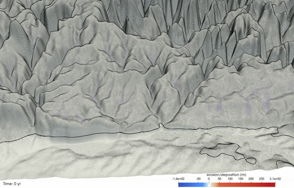
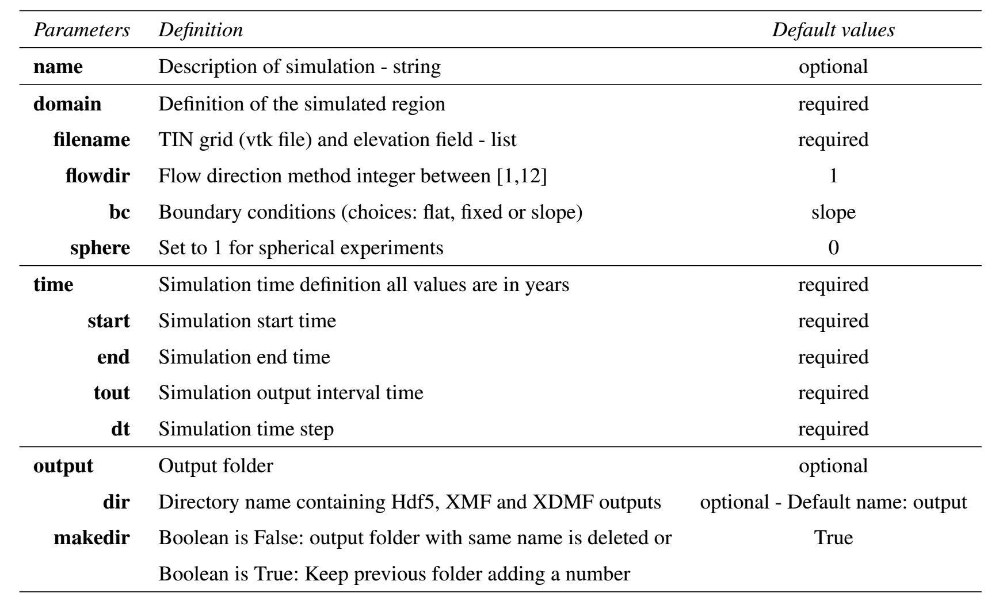
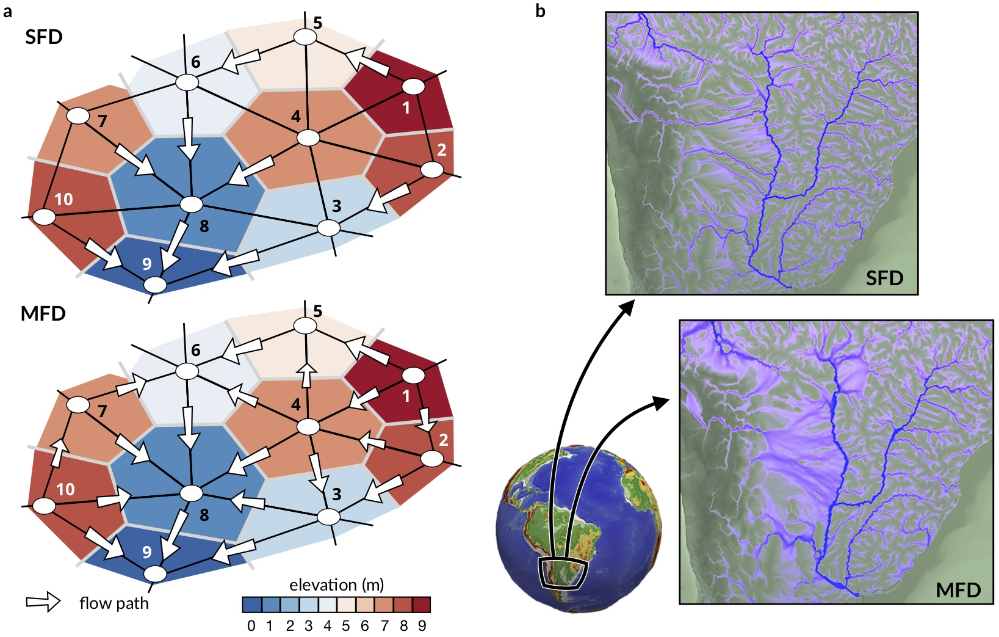
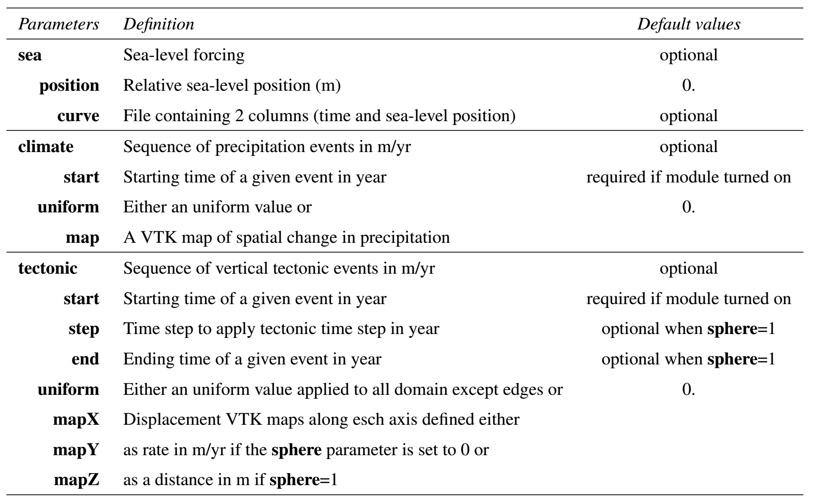
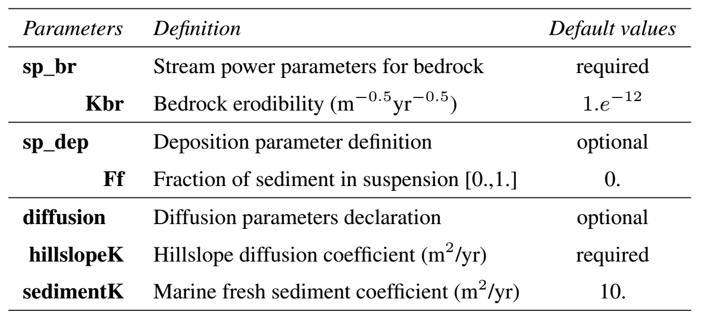

######################
Input description
######################

.. important::
  In **eSCAPE**, a **YAML** input file (`syntax`_) is used to set the parameters and conditions that apply to a given simulation.
  **YAML** structure is done through indentation (one or more spaces) and sequence items are denoted by a dash. When parsing the input file, the code is searching for some specific keywords defined below. Some parameters are optional and only need to be set when *specific forces* or *physical processes* are applied to a particular experiment.

.. _`syntax`: https://circleci.com/blog/what-is-yaml-a-beginner-s-guide/

Here we present the complete list of parameters that can be used in the current version of the code.

.. code-block:: yaml

    name: Description of the simulation...

    domain:
      filename: ['data/inputfileparameters.vtk','Z']
      flowdir: 5
      bc: 'slope'
      sphere: 0

    time:
      start: 0.
      end: 1000000.
      tout: 1000.
      dt: 100.

    sea:
      position: 0.
      curve: 'data/sealevel.csv'

    climate:
      - start: 0.
        uniform: 1.0
      - start: 500000.
        map: ['data/inputfileparameters.vtk','R']
      - start: 500000.
        uniform: 2.0

    tectonic:
      - start: 0.
        mapZ: ['data/inputfileparameters.vtk','T1']
      - start: 100000.
        uniform: 0.
      - start: 50000.
        mapZ: ['data/inputfileparameters.vtk','T2']

    sp_br:
      Kbr: 1.e-5

    sp_dep:
      Ff: 0.3

    diffusion:
      hillslopeK: 5.e-2
      sedimentK: 300.

    output:
      dir: 'outputDir'
      makedir: False

.. tip::
  All the input parameters that are defined in external files like the initial surface, different precipitation or displacement maps are read from VTK files and defined on an irregular triangular grid (TIN).

Examples on how to produce these files are provided in the `demo folder`_. The only exception is the sea-level file which is a two-columns CSV file containing on the first column the time in years and ordered in ascending order and on the second one the relative position of the sea-level in metres.

.. _`demo folder`: https://github.com/Geodels/eSCAPE-demo

The YAML structure is shown through indentation (one or more spaces) and sequence items are denoted by a dash. At the moment the following component are available:

+---------------------------------------------------------------------------+
| Input parameters relative to initial surface, temporal extent and output. |
+---------------------------------------------------------------------------+

The **domain** and **time** keywords are required for any simulation.

Domain
---------------------------------

.. code-block:: yaml

    name: Description of the simulation...

    domain:
      filename: ['data/inputfileparameters.vtk','Z']
      flowdir: 5
      bc: 'slope'
      sphere: 0

:code:`domain` : definition of the unstructured grid containing the **vtk** grid filename and the associated field (here called *Z*) as well as the flow direction method to be used **flowdir** that takes an integer value between 1 (for **SFD**) and 12 (for **Dinf**) and the boundary conditions (**bc**: ‘flat’, ‘fixed’ or ‘slope’)

.. tip::
  The *‘flat’* option assumes that all edges elevations are set to the elevations of their closest non-edge vertices, the *‘fixed’* option is used when edges elevations need to remain at their initial positions during the model run and the *‘slope’* option defines a slope based on the closest non-edge node average slope.

   Schematic diagram (in a) showing flow paths when considering a triangular irregular network composed of 10 vertices (node IDs are given for each case). Cells (*i.e.* voronoi area defining the region of influence of each vertex) are coloured by elevation. Two cases are presented considering **single flow direction** (*top sketch – SFD*) and **multiple flow direction** (*bottom sketch – MFD/Dinf*). White arrows indicate flow direction and their sizes vary in proportion to slope (not at scale). (b) Differences in calculated drainage area for a portion of South America from **eSCAPE** using the two flow direction methods.

Time
---------------------------------

.. code-block:: yaml

    time:
      start: 0.
      end: 1000000.
      tout: 1000.
      dt: 100.

The :code:`time` structure is also a required element in the YML input and defines the duration of the simulation from **start** to **end** time (in years). It is worth noting that these times can be negative, for example :code:`start` can be equal to -150,000 years and :code:`end` to -75,000 years.

.. caution::
  The only requirement is that start time needs to be lower than end time... (*don’t forget this is a forward model!*)

The user also needs to define the time step **dt** used to compute the model processes (erosion, transport and deposition).

Lastly, the user needs to define the output interval (**tout** - in years). Depending of the size of your model, decreasing the number of output by increasing **tout**  will make your simulation run quicker.

+---------------------------------------------------------------------------+
| Input parameters relative to forcing conditions.                          |
+---------------------------------------------------------------------------+

Sea
---------------------------------

.. code-block:: yaml

    sea:
      position: 0.
      curve: 'data/sealevel.csv'

By default, the sea-level (:code:`sea`) position in **eSCAPE** is set to 0 m. If you wish to set it to another position you can use the :code:`position` parameter that changes the sea-level to a new value relative to sea-level. Another option consists in defining your own sea-level curve (:code:`curve`) or using a published one (*e.g.* Haq curve for example).

.. important::
  The sea-level curve is defined as a 2 columns ASCII file containing in the first column the time in years (they don’t need to be regularly temporally spaced) and in the second the sea-level position for the given time (in metres). When the model runs, it will interpolate linearly between the successive times to define the position of the sea-level.

Climate & tectonic
---------------------------------

.. note::
  As for the sea-level structure, climate & tectonic are both optional. They may be defined as a sequence of multiple forcing conditions each requiring a starting time (**start** in years) and either a constant value applied to the entire grid (**uniform**) or spatially varying values specified in a file (**map**).

:code:`climate` & :code:`tectonic` : have the same structure with a sequence of events defined by a starting time (:code:`start`) and either a constant value (:code:`uniform`) or a :code:`map`.

.. code-block:: yaml

    climate:
      - start: 0.
        uniform: 1.0
      - start: 500000.
        map: ['data/inputfileparameters.vtk','R']
      - start: 500000.
        uniform: 2.0

.. code-block:: yaml

    tectonic:
      - start: 0.
        mapZ: ['data/inputfileparameters.vtk','T1']
      - start: 100000.
        uniform: 0.
      - start: 50000.
        mapZ: ['data/inputfileparameters.vtk','T2']

Surface processes
---------------------------

+---------------------------------------------------------------------------+
| Input parameters relative to physical processes.                          |
+---------------------------------------------------------------------------+

The default law available in **eSCAPE** is based on the *detachment-limited equation* (:code:`sp_br`), where erosion rate :math:`\dot{\epsilon}` depends on drainage area :math:`A`, net precipitation :math:`P` and local slope :math:`S` and takes the form:

.. math::
   \dot{\epsilon}=\kappa_{br} (PA)^m S^n

:math:`\kappa_{br}` (defined as the :code:`Kbr` element in the YML)  is a dimensional coefficient describing the erodibility of the channel bed as a function of rock strength, bed roughness and climate, :math:`m` and :math:`n` are dimensionless positive constants.

.. code-block:: yaml

    sp_br:
      Kbr: 1.e-5

.. image:: images/escape_mountain.gif
   :scale: 80 %
   :alt: demo
   :align: center

.. important::
  It is worth noting that the coefficient :math:`m` and :math:`n` are fixed in this version and take the value *0.5* and *1* respectively.

.. code-block:: yaml

    sp_dep:
      Ff: 0.3

Once the entrainment rates have been obtained, the sediment flux moving out at every node :math:`Q_s^{out}` equals the flux of sediment flowing in plus the local erosion rate. :math:`Q_s^{out}` takes the following form:

.. math::
   Q_s^{out} = Q_s^{in} +(1-F_f )E \Omega

:math:`\Omega` is the voronoi area of the considered vertex and :math:`F_f` (:code:`Ff`) is the volumetric fraction of fine sediment small enough to be considered permanently in suspension.

As an example, in case where bedrock breaks only into sand and gravel fractions, :math:`F_f` would be zero.  As a result, simulated deposits and transported sediment flux in the model only include sediment coarse enough that it does not permanently stay in suspension.

.. note:
  If we consider that all eroded sediments are transported as fine suspension :code:`Ff`=1 and as such will never be redeposited. The model therefore will be **purely erosive**.

Diffusion
--------------

.. note::
  Transport along slope by gravity is simulated using **a linear diffusion law** referred to as **soil creep**.

.. math::
  \frac{\partial z}{\partial t}= D \nabla^2 z

in which :math:`D` is the diffusion coefficient (:code:`hillslopeK`) set for both marine and land environments.

.. code-block:: yaml

    diffusion:
      hillslopeK: 5.e-2
      sedimentK: 300.

The marine deposition of river transported sediments are simulated with a diffusion law as well and relies on a different diffusion coefficient (:code:`sedimentK`).

Output
--------------

Model's :code:`output` are stored in a  directory name (:code:`dir`) and the option (boolean) :code:`makedir` gives the possibility to delete any existing folder with the same name (if set to False) or to create a new folder with the given :code:`dir` name plus a number at the end (*e.g.* outputDir_XX if set to True with XX the run number)

.. code-block:: yaml

    output:
      dir: 'outputDir'
      makedir: False

The :code:`output` element is optional but is highly recommended as it enables you to specify your ouput folder name (:code:`dir`). If not specified, the default name will be **output**.

.. important::
  To prevent the deletion of any output folders if you have not changed the folder name, the code automatically creates a new name which add an underscore and a number at the end of the output filename.

As an example, let us consider you have already ran a model with the :code:`dir` element set to :code:`’myexp’` and you have decided to change the erodibility value in the SPL law but kept the folder name the same and have :code:`makedir` set to True.

**eSCAPE** will create a new folder named :code:`’myexp_0’`. If you keep changing any parameters omitting to change the folder name, you will have a list of folders like :code:`’myexp_1’`, :code:`’myexp_2’`, :code:`’myexp_3’`...
